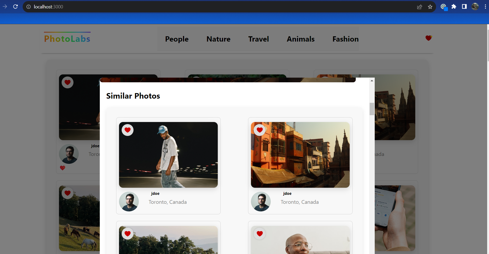

# React-Photolabs
The PhotoLabs project for the Web Development React course programming.

# Table of Contents
1. Introductions
2. Features
3. Setup
4. Dependencies
5. Final Product

# Photolabs
PhotoLabs is a dynamic React-based single-page application that offers a seamless user experience by showcasing photos from various contexts. Dive in and interact with some of the best visual content!

## Features 
- Dynamic Photo Viewing
- Image Comparison in Modal
- Explore Topics
- Enhanced Photo Interaction
- Personalized Experience
- Persistent Data

## Setup
Install dependencies with `npm install` in each respective `/frontend` and `/backend`.

## Dependencies
- React
- Express
- Webpack
- Babel
- PostgreSQL
- SASS


## [Frontend] Running Webpack Development Server

```sh
cd frontend
npm start
```

## [Backend] Running Backend Servier

Read `backend/readme` for further setup details.

```sh
cd backend
npm start
```

## Final Product
The Home Page


The Enhanced Modal


The Comparison in Modal


Liked Images
